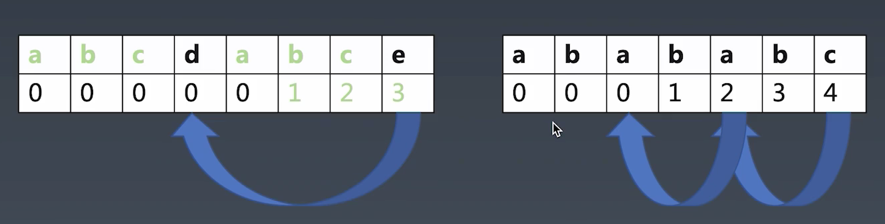

## 字符串分析算法
- 字典树
    - 大量高重复字符串的存储与分析
- KMP
    - 在长字符串里找模式
- Wildcard
    - 带通配符的字符串模式
- 正则
    - 字符串通用模式匹配
- 状态机
    - 通用的字符串分析
- LL LR
    - 字符串多层级结构分析

### KMP
通过运用对这个词在不匹配时本身就包含足够的信息来确定下一个匹配将在哪里开始的发现，从而避免重新检查先前匹配的字符。

1. 求跳转表格
2. 进行真正的匹配

资料：http://www.ruanyifeng.com/blog/2013/05/Knuth%E2%80%93Morris%E2%80%93Pratt_algorithm.html
### Boyer-Moore
它不需要对被搜索的字符串中的字符进行逐一比较，而会跳过其中某些部分。通常搜索关键字越长，算法速度越快。它的效率来自于这样的事实：对于每一次失败的匹配尝试，算法都能够使用这些信息来排除尽可能多的无法匹配的位置。