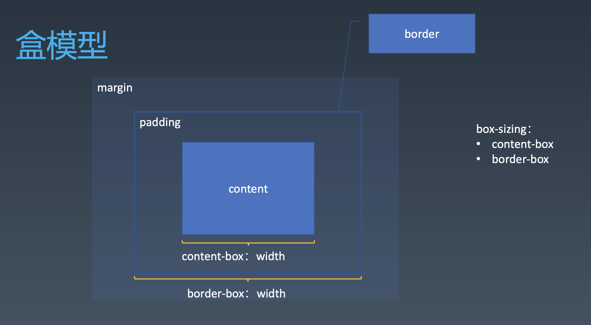
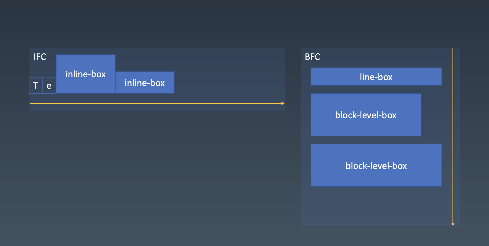

# CSS排版

## 盒

源代码 | 语义 | 表现
---|--- | ---
Tag | Element | Box

HTML代码中可以书写开始标签，结束标签，和自封闭标签。

一对起止标签 ，表示一个元素。

DOM树中存储的是元素和其它类型的节点（Node）。

CSS选择器选中的是元素或伪元素。

CSS选择器选中的元素，在排版时可能产生多个盒。

排版和渲染的基本单位是盒。

## 盒模型

## 正常流

我们如何写字？
- 从左到右书写
- 同一行写的文字都是对齐的
- 一行写满了，就换到下一行

### 正常流排版
- 收集盒和文字进行
- 计算盒和文字在行中的排布
- 计算行的排布

### Baseline

inline-block，行内盒，是随之自己里面文字的基线去变化的。

vertical-aglin:top,和行的顶缘对齐
vertical-algin:bottom,和行的底缘对齐

### 正常流的块级排布
float会影响生成的行盒的尺寸

**正常流程只有BFC会发生边距折叠margin collapse**